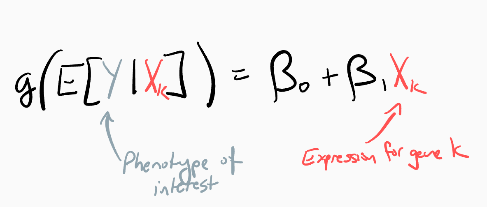
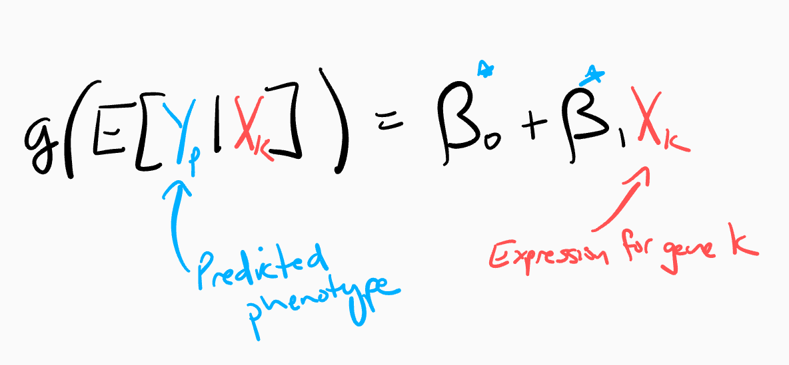
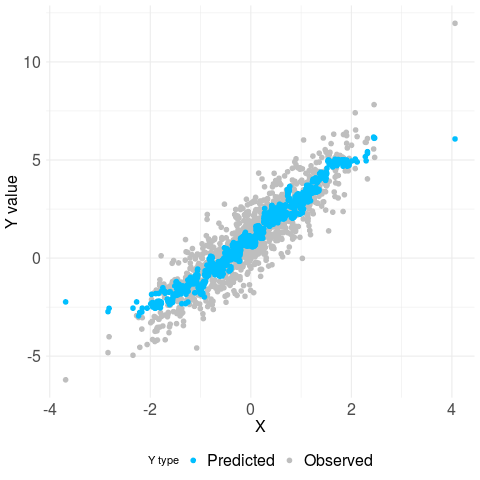

### postpi: Post-prediction Inference

### Overview


Many modern problems leverage machine learning methods to predict outcomes based on observable covariates. However, in the subsequent statistical modeling, e.g. to understand population trends in outcomes, often involves treating predicted outcomes as interchangeable with observed outcomes. `postpi` is an R package we developed to correct downstream statistical inference using outcomes predicted with an arbitrary machine learning method. 

For example, if we want to study association between outcome vector y and covariate of interest \(x_k\), we can fit a simple regression model and estimate \(\beta_1\): 


However, since we do not always observe outcomes for all samples, we often predict outcomes using known covariates from a machine learning tool. Then predicted outcomes from complicated prediction models become inputs into subsequent statistical analyses as:


Then we estimate \({\beta^*}_1\) and conduct hypothesis testing as if \({\beta^*}_1\) contains the same property of \(\beta_1\) -- this is not true! Interchanging predicted outcomes as observed outcomes in the subsequent inference model causes problems. 

Let's further examine the problem by plotting observed outcomes Y (grey color) and predicted outcomes \(Y_p\) (blue color) against a covariate of interest X from a simulated example:



From the plot, we observe the problem -- standard errors of the estimate \({\beta^*}_1\) using predicted outcomes are much smaller than the standard errors of the estimate \(\beta_1\) using observed outcomes. Reduced standard errors further lead to larger test statistics when conducting hypothesis testings for the estimates and therefore cause more false positives.

Now our package `postpi` becomes handy to correct such biases in the estimates, standard errors and test statistics for both continuous and categorical data. `postpi` contains three functions: 

* `postpi_relate` 
    + required inputs: a data set (i.e. testing set) containing only observed and predicted outcomes, and column name for observed outcomes.
    + optional inputs: a method from the [caret](http://topepo.github.io/caret/index.html) package that user defines to relate categorical observed outcome and probablities of predicted categories. The default method set for the function is k-nearest neighbors.
    + purpose: the function models the relationship between observed outcomes and predicted outcomes/probabilities, and returns the relationship model. 

* `postpi`
    + required inputs: a data set (i.e. validation set) containing predicted outcomes and covariates, the relationship model estimated from `postpi_relate()`, and an inference formula.
    + optional inputs: the number of bootstrap times, and a seed number. The default number of bootstrap times is 100 and the default seed number is 1234.
    + purposes: the function provides the corrected inference result table using a bootstrap approach for continuous/catigorical outcomes. The format of the output is a tidy table with 5 colomns: term, estimate, std.error, statistic, p.value.

* `postpi_der`
    + required inputs: a testing set containing observed and predicted continuous outcomes, column names for observed and predicted outcomes, a validation set containing predicted outcomes and covariates, and an inference formula.
    + optional inputs: None.
    + purposes: the function provides the corrected inference result table using a derivation approach only for continuous outcomes. The format of the output is a tidy table with 5 colomns: term, estimate, std.error, statistic, p.value.


### Procedure to use the package

1. Prepare a data set with observed outcomes and predicted outcomes/probabilities for each predicted categories, and covariates of interest for subsequant inferential analyses.

2. Split the data set into testing and validation sets. On testing set, use `postpi_relate()` to estimate a relationship model. 

3. On validation set, use `postpi()`/`postpi_der()` to conduct inferential analyses.

Note: If users have a subset of observed outcomes but no predicted outcomes, they should split the data set into three sets -- training, testing, and validation sets. On training set, use a machine learning method to train a prediction model, and apply it to testing and validation sets to get predicted results. Then users should repeat step 2-3 above to obtain inference results.


### Installation

    devtools::install_github("SiruoWang/postpi")
    
Package can be loaded into R as follows:

    library('postpi')


### Example 

In this section, we include a simple example to use the package on a data set with continuous outcomes. We also provide a detailed tutorial on how to use our package with multiple examples on both continuous and categorical data in the  [vignettes](http://www.siruowang.com/postpi/doc/vignettes.html).


In this example, we use a data set `RINdata` available in the package. `RINdata` contains a column of observed RIN values named `actual`, a column of predicted RIN values named `prediction` obtained from a previous trained data set, and 200 columns of gene expression regions. We want to study associations between RINs and gene expression levels. A detailed description of the `RINdata` data set is available at our paper [Post-prediction inference](a link to preprint).

1. We load `RINdata` and split data into testing and validation sets using the `rsample` package. 

    ```{r}
    data("RINdata")
    data <- RINdata
  
    set.seed(2019)
    data_split <- rsample::initial_split(data, prop = 1/2)
    testing    <- rsample::training(data_split)
    validation <- rsample::testing(data_split)
    ```

2. We select the columns of the observed and predicted outcomes from `RINdata`, and pass it to `postpi_relate()` to estimate a relationship model named `rel_model`. We pipe our code using `%>%` from the `dplyr` package.

    ```{r}
    library(dplyr)
    rel_model <- testing %>%
                 select(actual, predictions) %>%
                 postpi_relate(actual)
    ```          

3. We define an inference formula `predictions ~ region_10` such that we want to relate gene expression levels in region 10 to predicted RINs. Then we pass in the validation set, the defined inference formula, and the relationship model `rel_model` estimated above to the inference function `postpi()`. In `postpi()` we estiamte inference results using a bootstrap approach and we obtain the results in a tidy table format named `results_postpi`.

    ```{r}
    inf_formula <- predictions ~ region_10

    results_postpi <- validation %>%
                      postpi(rel_model, inf_formula)
    ```

We have the inference result interpretation & more examples available in the  [vignettes](http://www.siruowang.com/postpi/doc/vignettes.html).


### Contact
Siruo Wang: swang171@jhu.edu


